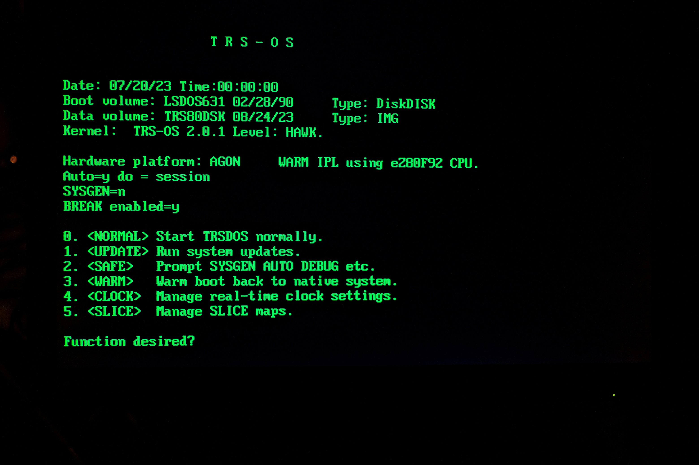
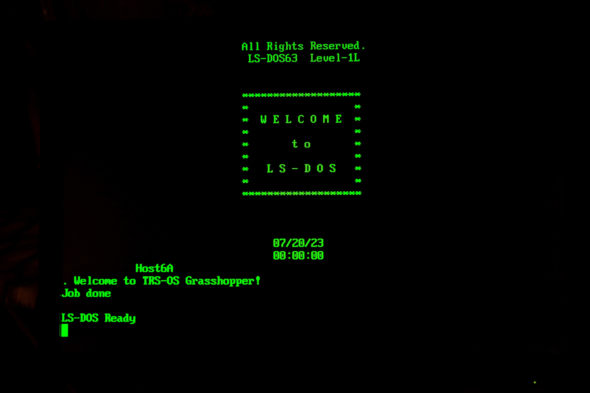
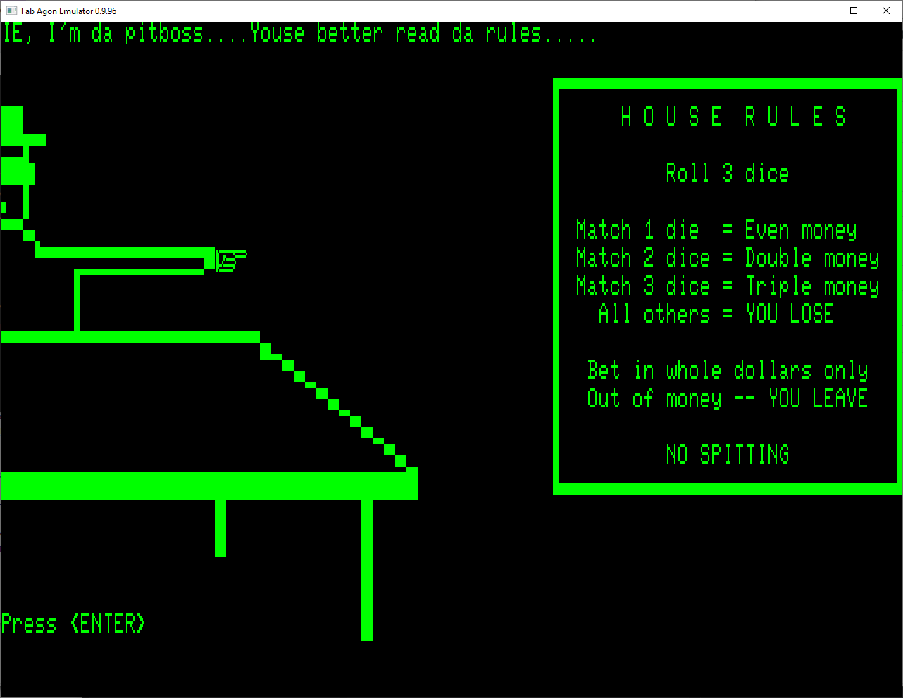

# Table of Contents
* [OSboot Overview](#osboot-overview)
* [Font Support](#font-support)
* [What can I run with it?](#what-can-i-run-with-it)
* [What hardware is it equivalent to?](#what-hardware-is-it-equivalent-to)
* [Usage](#usage)
* [Making your own disk images](#making-your-own-disk-images)

# OSboot Overview
This tool is to boot up [TRS-OS](https://danielpaulmartin.com/home/research/). It only runs from the `/mos` directory. Only a binary is available at the moment. Source may be released in future. Booting TRS-OS allows well-behaved TRS-80 Model 4 software to run natively on Agon Light.

TRS-OS was designed and built by Danial Paul Martin as a way to run LS-DOS on modern (eZ80) based hardware, and is made available on Agon by a combination of Daniel's work on TRS-OS development along with my development of this loader. You can download the [TRS-OS binary via here](https://danielpaulmartin.com/how%20do%20i%20get/).

For the best expeience, it is *highly* recommended that you update your MOS and VDP to version current versions. Minimmum recommended VDP is 2.11.0. You can use older versions, however, notable additions required include my vdp contributions including ADDS25 terminal emulation, which ensures the screen behaves properly in ADDS25 mode. If you're curious or want to compile you own, my fork of the VDP-gl library is [here](https://github.com/sijnstra/vdp-gl).

# Font Support
I've provided a Woodie edition update `OSboot.bin` which also has some extra features baked in. My terminal mode font updates are merged into the main Agon VDP, version 2.11.0. If you update to 2.11.0 (or later) from https://github.com/sijnstra/agon-vdp-console8 you can take advantage of the new features by having the lo-res TRS-80 graphics and font available. Download the font file `TRS80M4Pg.F10` from here and store it in your SD card. Then you'll need to load the font using `loadfont 1 <pathname>\TRS80M4Pg.F10`. If you don't have it already you can grab `loadfont` from [Lennart Benschop's github](https://github.com/lennart-benschop/agon-utilities). I recommend adding this to your `autoexec.txt`, after which you can take advantage of the new `-f` command to load the contents of font 1 into the terminal mode.

Using the TRS-80 native font not only gives the proper TRS-80 look forthe characters, it also makes the text spacing and ratios correct. The built-in Agon font is 8x8 wheras the TRS-80 font is 8x10. The font file `TRS80M4pG.F10` is provided in this directory.

Note that the top bit (i.e. for graphics) is only available in the vt100 mode by default. A change to the driver is required to allow the top bit to be sent from the ADDS25 mode. I have done this with previous versions of TRSOS by editing the TRSOS binary blob, replacing both instances of `FE803841` with `FE801841`. You can then use mode 2 instead of mode 4 to have access to the full character set plus inverse characters. The downside of the ADDS25 mode is that if any data is poked straight into video memeory, it will not be visible. The vt100 full screen refresh mode does not support reverse text. This means there are pros and cons to both modes.

# What can I run with it?
Well behaved TRS-80 model 4 programs are able to run natively on Agon. This includes software on Tim Mann's site, among many others. This works because the TRS-OS operating system is a wrapper for LS-DOS 6.3.1, allowing Agon to boot an unmodified LS-DOS. The devices for keyboard `*KI` and display `*DO` are intercepted by a terminal emulation program, and use UART0 to communicate back the the Agon's VDP. This means the Agon VDP is an external terminal for LS-DOS running on the eZ80. While HiRes graphics is not available, the TRS-80 font and graphics can be made avaialble by using the VDP 2.11.0 or higher font management features. Please note the below screenshots running on physical hardware were taken before the font features were made avaialble.

# What hardware is it equivalent to?
At the moment it is a fairly standard TRS-80 Model 4 without Model 3 mode. It has 2 virtual floppy drives, with the default being 2 x 180k disks - i.e. they are 40 track, single sided, double density. The memory map of the Agon limits the size of the second floppy. As communication is over the serial port internally, this means there is no hires graphics. With font support loaded and patching to allow full 8 bit data transger, lo-res graphics and the TRS-80 font is supported.

As the Agon runs on an eZ80 at 18.432MHz, and the eZ80 supports instruction pipelining, it is equivalent to around 3x the speed of a regular z80.  This makes it equivalent to around a 54MHz model 4.

If you use the terminal updates above, this enables features like clear screen and reverse character text to work in ADDS25 terminal mode.

# Usage
`OSboot [-Xvf] <binaryfile> [diskfile]`

The optional parameters can include any of the following:
* `X` which represents a single digit specifying the screen colour: `-1` (red) ... `-7` (white). Default is `-2` (green).
* `v` forces VT100 terminal mode instead of ADDS25 (default)
* `f` asks terminal mode to use `font 1`, which requires the font to be loaded, and VDP to be a minimum of v2.11.0

The `<binaryfile>` is the TRS-OS binary, downloaded using the link above.

The third optional parameter loads a virtual disk image into memory at `0x45300`, in JV1 or DiskDISK format, up to 210K in size. DiskDISK will allow you to have your disk geometry of choice, while JV1 is a much simpler format. There are a few programs out there to maipulate JV1 formats. I use them to create an 80 track single sided single density disk which fits in the 210k space.

# Making your own disk images
TRS-OS supports in-memory loading of both DiskDISK and JV1 floppy disk images. The easiest way to generate your own floppy images is to use JV1 image files. Note that the memory map has changed a few times, and that the 512K memory map of the Agon Light limits the available disk image space. I recommend making a smallest feasible disk - a 35 track single sided single density.

I've included a sample .JV1 disk image `TRSOS_Demo.JV1` above.

There are a number of JV1 manipulation tools available. A good place to start is [Ira Goldklang's list of Virtual Disk Utilities](https://www.trs-80.com/wordpress/emulators/disk-utilities/)
