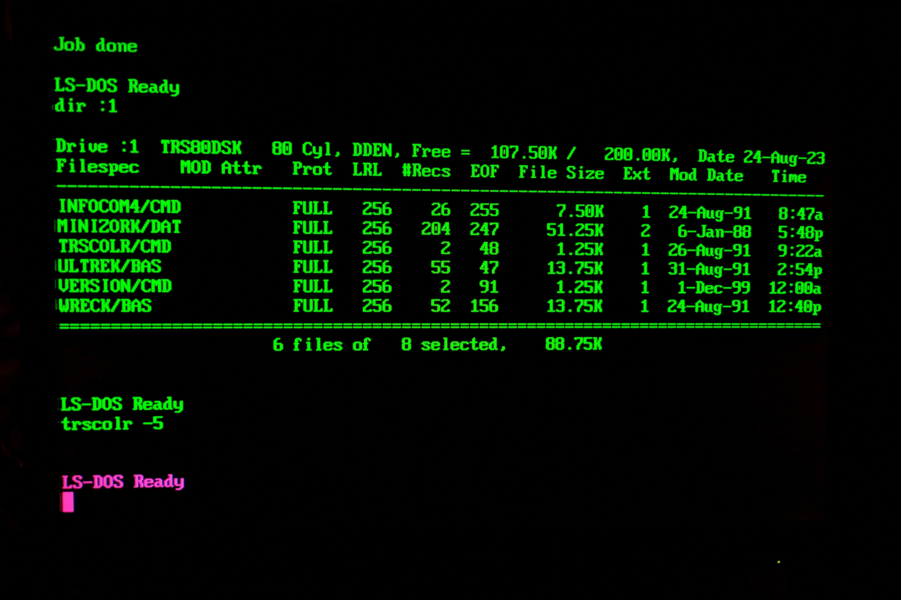

# OSboot
This tool is to boot up [TRS-OS](https://danielpaulmartin.com/home/research/). It only runs from the `/mos` directory. Only a binary is available at the moment. Source may be released in future. Booting TRS-OS allows well-behaved TRS-80 Model 4 software to run natively on Agon Light.

TRS-OS was designed and built by Danial Paul Martin as a way to run LS-DOS on modern (eZ80) based hardware, and is made available on Agon by a combination of Daniel's work on TRS-OS development along with my development of this loader. You can download the [TRS-OS binary via here](https://danielpaulmartin.com/how%20do%20i%20get/).

For the best expeience, it is *highly* recommended that you update your MOS and VDP, along with vdp-gl to version 1.04. This will include ADDS25 terminal emulation, ensuring the screen behaves properly. The ADDS25 terminal code has now been merged into the main branch and required VDP files - my fork is [here](https://github.com/sijnstra/vdp-gl).

# What can I run with it?
Well behaved TRS-80 model 4 programs are able to run natively on Agon. This includes software on Tim Mann's site, among many others. This works because the TRS-OS operating system is a wrapper for LS-DOS 6.3.1, allowing Agon to boot an unmodified LS-DOS. The devices for keyboard `*KI` and display `*DO` are intercepted by a terminal emulation program, and use UART0 to communicate back the the Agon's VDP. This means the Agon VDP is an external terminal for LS-DOS running on the eZ80, so things like graphics (high or low res) are not yet available.

# What hardware is it equivalent to?
At the moment it is a fairly standard TRS-80 Model 4 without Model 3 mode. It has 2 virtual floppy drives, with the default being 2 x 180k disks - i.e. they are 40 track, single sided, double density. As communication is over the serial port internally, this means there is no hires and no lo-res graphics. 

If you use the terminal updates above, this enables features like clear screen and reverse character text to work.

# Usage
`OSboot [-X] <binaryfile> [diskfile]`

The first optional parameter specifies the colour: `-1` (red) ... `-7` (white). Default is `-2` (green).

The `<binaryfile>` is the TRS-OS binary, downloaded using the link above.

The third optional parameter loads a virtual disk image into memory at `0x45300`, in JV1 or DiskDISK format, up to 210K in size. DiskDISK will allow you to have your disk geometry of choice, while JV1 is a much simpler format. There are a few programs out there to maipulate JV1 formats. I use them to create an 80 track single sided single density disk which fits in the 210k space.
