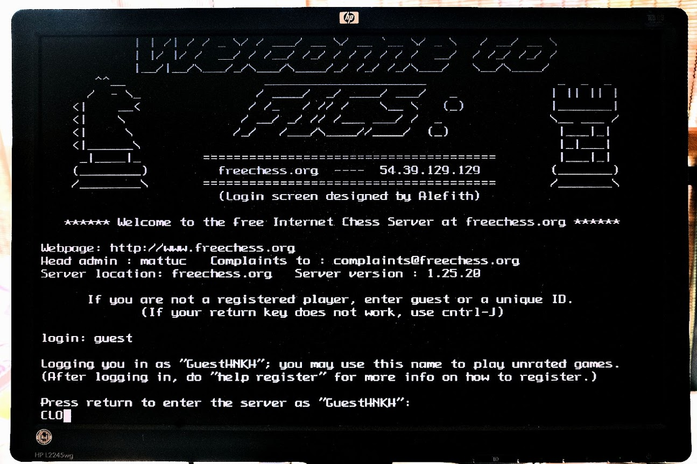
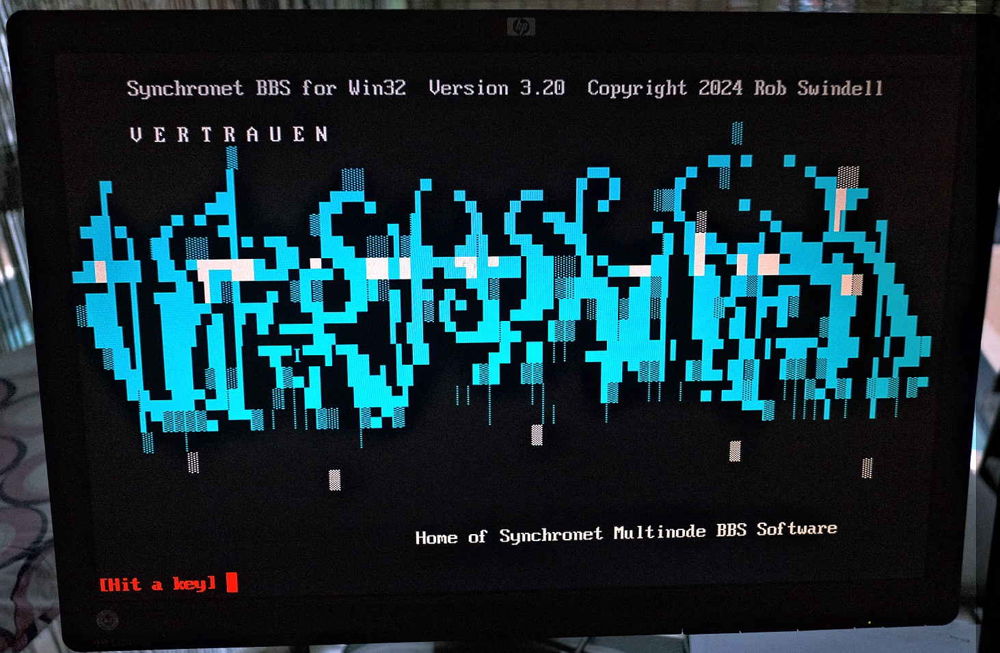

# telnet.bin
This is a MOS utility to telnet straight from your Agon to remote networks using the ESP8266 wifi board, particularly the one built by Olimex.

Please note this is a BETA release as there are a number of stability issues which seem to depend on network throughput. See Known Issues below.

It is designed to be compatible with Nihirash's snail gopher browser and setup utilities, minimising any changes needed on the part of the user.

The software has been updated on 22-Mar-2025 to solve some cosmetic character re-sending issues.

# usage
built-in help text :
```
   telnet [-fNcdekrs] <url or IP>[:port]
      -fN select font N for terminal mode, where N = 1...65534
      -d drop any session then optionally attempt to connect (ESP8266 restart)
      -e turn on local echo on ESP8266
      -c will swap CR and LF characters sent, often used with k
      -k echo keyboard characters when they are typed
      -r re-enter an open session after crash (mutually exclusive with -d)
      -s use SSL function of ESP8266 which lacks ciphers & is experimental
      [port] is optional - defaults to 23

   for example: telnet -f42 mtrek.com:1701 connects to mtrek.com port 1701 using font 42
```

# ESP8266 firmware
AT version 1.7.6 or better (on the AT 1.7.x branch) is recommended.
AT version 2.2.x is missing commands used by the 1.7.x branch
Version update instructions are linked below in the setup section
Assumes the default serial speed of 115200 bps.
This does not use or require zimodem firmware.

# Thanks
Thanks to [Nihirash](https://github.com/nihirash) for trail blazing and sharing code. The source for this will be shared in the future.

# setup
Please see [Nihirash's excellent tools](https://github.com/nihirash/Agon-MOS-Tools/tree/main/esp8266) for connecting to and maintaining your ESP8266 Wifi module.

# recommended sites
Any telnet site with a reasonably paced amount of traffic.
For example:
* telehack.com
* freechess.org:5000 `*`
* mtrek.com:1701
* batmud.bat.org `**`

`**` use `-ck` to see your responses and use the enter key.

`*` Here's a screenshot of connecting to freechess, noting that to get local echo you need to use the `-k` flag, and that it expects CTRL-J to be used as enter. For some reason I can't get the `-c` flag to work.


And sometimes if the wind is blowing the right way, network traffic can allow BBS sites with ASCII art to load:


# known issues
* It is possible to overwhelm the system with too much text/data downloaded, and the VDP may crash as a result. If this happens, you can reboot your Agon and try the `telnet -r` feature to reconnect.
* initial handshake does not interpret requirements for CRLF and local echo, hence the -c and -k commands
* For some reason, swapping sending of CR and LF characters doesn't work on all sites.
* Some sites seem to not connect properly every time. I recommend trying again.
* The software does not have a universal exit. Use the reset button.
* Note: the software has been tested with lower speed down to 38400, however, this was still insufficient. It is unclear if issues are caused due to the lack of handshaking, if the firmware provided has bugs at high speed, or if the telnet code has issues.
